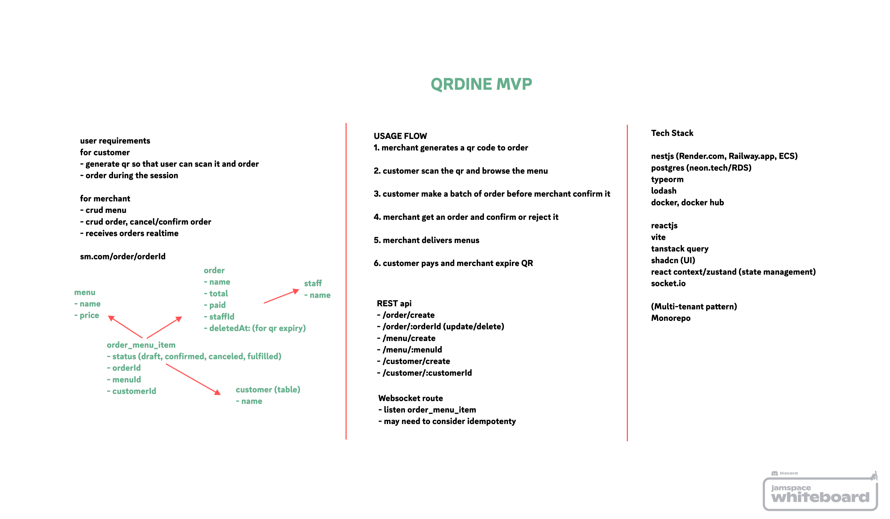

# QR Dine

Restaurant order management makes easy.

### development

- install docker
- run `npm run dev`
- run `npm run cli dev-setup` to setup databases
- graphql playground is available at `http://{host}:{port}/graphql`

### note

- restart `docker compose` after making changes in .env
- lodash default import doesn't work should be imported as `* as _`
