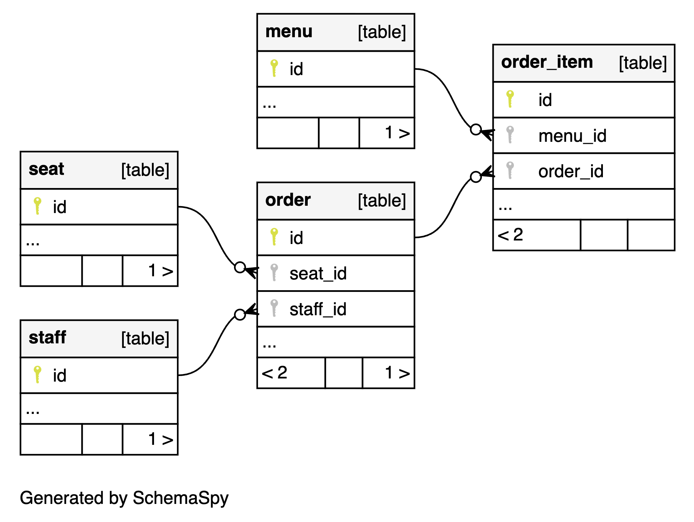

# Onboarding

## glossary

- **merchant**: a business that uses our platform to manage their products and orders

## Database Overview

- multi-tenant architecture (each merchant has its own database)

### `hub` database

- stores metadata about all merchants

## graphql and drizzle-orm

### creating/modifying a table

- create a sql file
- create a Typeorm entity (It also defines Graphql type)
